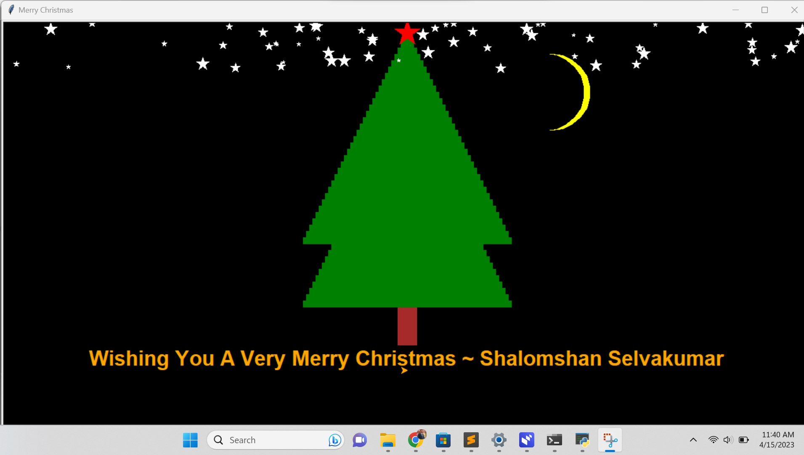

# Christmas Wishing Project Python

## Introduction

This is a simple program is written in python and turtle library. The objective of this program is to wish merry Christmas programmatically. It draws trees and stars as soon as it is executed with a background Christmas song.


## Installing Dependencies


  ```
    pip install playsound
  ```


Note:- Turtle library is preinstalled with python programming language. Therefore, no need to install it separately.

## Demo



## Execution

- Running the program

  ```
    python run.py
  ```


Any Questions? | Conduct Me
---

* [Linkedin Profile](https://www.linkedin.com/in/shalomshan-selvakumar-423aaa1aa/)
* [Facebook Page](https://web.facebook.com/selvakumar.shalomshan)
* [Twitter Profile](https://mobile.twitter.com/SHALOMSHANS)
* [Instagram Profile](https://www.instagram.com/shalomshanselvakumar/)
* [Youtube Channel](https://www.youtube.com/channel/UCeQfTqz1hxhe_Lt37I2JLDg)
